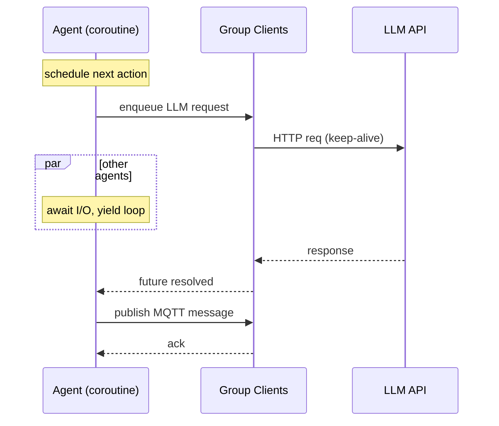

# AgentSociety 性能与架构深度分析（Performance Whitepaper）

> 目标：把论文中的关键性能优化与系统架构拆到“可落地”的层面，给出可复现配置与扩展建议。本文不改变原设计哲学： **Never break userspace / 实用主义 / 简洁执念** 。

---

## 0. TL;DR（一页版）

* **通信协议** ：MQTT（发布/订阅），Topic 设计按 `exps/<exp_uuid>/agents/<agent_uuid>/*` 分层；天然支持百万级连接、低开销、可靠分发。
* **并发执行** ：Ray 多进程 + asyncio 异步 I/O；
* **Agent Group** 把多 Agent 绑进同一进程， **复用连接** （LLM、MQTT、DB、Metrics），避免  **TCP 端口耗尽** 。
* I/O 密集（LLM/环境交互）用协程并发，CPU 时段跑本地算法（如 Gravity Model）。
* **数据与度量** ：PostgreSQL（`COPY FROM` 批写）+ mlflow 中央化指标；AVRO/DB 双落盘。
* **已知瓶颈** ：最慢 group 拖累整体；需要跨组动态调度与背压；Broker 水平扩展策略要提前规划。

---

## 1. 总体架构（System Architecture）

### 1.1 组成

* **Shared Services** ：LLM API、MQTT Broker、PostgreSQL、mlflow。
* **Experiment Runtime** ：Ray Actor（每 Actor 即一个 **Agent Group** 进程），组内共享客户端连接；环境模拟器以子进程运行；GUI 读 DB 与 MQTT。

```mermaid
flowchart LR
  subgraph Shared[Shared Services]
    LLM[LLM API]
    MQ[MQTT Broker]
    DB[(PostgreSQL)]
    MF[mlflow Server]
  end

  subgraph ExpA[Experiment A]
    A1[Ray Actor / Agent Group #1]\nLLM/MQ/DB/MF clients
    A2[Ray Actor / Agent Group #2]
    ENV1[Env Simulator Subprocess]
  end

  subgraph ExpB[Experiment B]
    B1[Ray Actor / Agent Group #k]
    ENV2[Env Simulator Subprocess]
  end

  GUI[GUI Backend/Frontend]

  A1-- pub/sub -->MQ
  A2-- pub/sub -->MQ
  B1-- pub/sub -->MQ
  GUI-- pub/sub & query -->MQ

  A1-- batch write -->DB
  A2-- batch write -->DB
  B1-- batch write -->DB
  GUI-- read -->DB

  A1-- metrics -->MF
  A2-- metrics -->MF
  B1-- metrics -->MF

  A1-- req/resp -->LLM
  A2-- req/resp -->LLM
  B1-- req/resp -->LLM
```

### 1.2 关键约束与设计动机

* **约束 A：端口资源有限** （每主机每进程每目标服务有连接/端口上限）。
* **约束 B：I/O 主导** （LLM/环境 RPC 等待时间远大于本地计算）。
* **动机** ：用 **Group 复用连接** 降低端口占用；用 **Ray+asyncio** 把等待时间榨干。

---

## 2. 通信层（MQTT）

### 2.1 Topic 规范

* `exps/<exp_uuid>/agents/<agent_uuid>/agent-chat`：Agent→Agent 文本消息。
* `exps/<exp_uuid>/agents/<agent_uuid>/user-chat`：用户→Agent 对话。
* `exps/<exp_uuid>/agents/<agent_uuid>/user-survey`：结构化问卷下发。

 **订阅策略** ：每个 Agent 只订阅自己前缀 `exps/<exp_uuid>/agents/<agent_uuid>/#`，即插即用，低认知负担。

### 2.2 QoS 与保序建议

* 论文未强制 QoS。工程落地建议：
  * **QoS 1** （至少一次）满足多数社交消息；
  * 关键干预/调查可用  **QoS 2** ；
  * 对话上下文依赖顺序时开启 **Broker 端保序** 或在 Payload 内携带 `seq_id`，应用层去重与重排。

### 2.3 Broker 扩展

* 选择 **EMQX** 或同级高性能 Broker；
* 提前启用：
  * **集群化** （节点内共享会话/订阅）；
  * **持久化会话** （断线重连不抖动）；
  * **限流/背压** （保护下游 LLM/DB）。

> **反模式** ：每 Agent 单独进程各自建连接。会把 Broker、DB、LLM 的端口直接打爆。

---

## 3. 执行层（Ray + asyncio + Agent Group）

### 3.1 Group 设计

* 一个  **Agent Group = 一个进程（Ray Actor）** ；
* 组内共享：`LLMClient / MQTTClient / EnvClient / DBClient / MetricsClient`；
* **好处** ：

1. 连接复用，端口占用降到“按组数计”。
2. LLM/DB/MQTT 的 TCP 连接长连复用，降低握手与系统调用开销。

### 3.2 并发模型

* **asyncio** ：对 I/O 操作（LLM 请求、MQTT 收发、DB 批写、Env RPC）以 `await` 驱动；
* **Ray** ：多 Actor 并行，跨机透明扩展；
* **本地计算** （如 Gravity Model/解析/过滤）穿插在事件循环可用的 CPU 缝隙执行。



### 3.3 端口资源与上限

* 理论上限：**65535** 本地端口；但 OS、NAT、TIME_WAIT、FD 限制更苛刻。
* **Group 化**把连接数从 `O(#agents)` 降到 `O(#groups)`，配合连接池：
  * LLM：HTTP keep-alive + 池化；
  * DB：批写（`COPY FROM`）+ 低频连接创建；
  * MQTT：单连接多订阅（按 Topic 前缀）。

### 3.4 吞吐估算（粗略上界）

设：

* 每组并发 **c** 条协程在跑 LLM/API；
* 单请求平均延迟  **L** （含排队）；成功率  **p** ；组数  **G** 。

则系统级有效 RPS 近似：

RPS_eff≈G⋅c⋅pL\text{RPS}\_\text{eff} \approx \frac{G\cdot c\cdot p}{L}

> 优化抓手：增大 `G` 与 `c`，或降低延迟 `L`（短上下文、靠前缓存、流式）。

### 3.5 已知风险

* **慢组拖累** ：固定分组导致最慢 Actor 决定批次节拍。
* 对策：跨组任务窃取（work stealing）或 **动态分桶** （rebalance）。
* **尾延迟** ：少量超长 LLM 调用挤压事件循环。
* 对策：超时与降级策略（重试/切模型/切 provider）。

---

## 4. 存储与度量

### 4.1 PostgreSQL 批写

* 海量日志与状态落库：采用 `COPY FROM` 实现  **批量写入** 。
* 表结构建议（最小化）：
  * `agents(profile, static)`；
  * `states(agent_id, ts, kv_jsonb)`；
  * `messages(exp_id, src, dst, ts, payload_jsonb)`；
  * `surveys(exp_id, agent_id, ts, form_id, answers_jsonb)`；
  * `errors(exp_id, ts, comp, detail)`。
* **索引** ：`(exp_id, ts)`、`(agent_id, ts)`；日志表分区按日期或 `exp_id`。

### 4.2 mlflow 指标

* 统一记录：吞吐、平均/尾延迟、错误率、经济/社会宏观指标（如 GDP、互动频次）。
* **Run 粒度** ：一实验一 Run；关键阶段另起子 Run。

### 4.3 双写与回放

* AVRO 本地归档 + DB 在线查询；
* GUI 播放轨迹、消息、思维链与问卷。

---

## 5. LLM 访问层（可靠性工具）

* **API 适配器** ：兼容 OpenAI 风格；可切本地推理（vLLM/ollama）。
* **重试** ：默认 3 次；按错误类型区分是否重放（幂等性保证）。
* **JSON 解析器** ：自动剥离 Markdown code fence，转 Python 对象；
* **Prompt 预算** ：限制上下文长度，启用函数式输出约束以稳定解析。

> 反模式：把 JSON schema 写得像小说一样复杂。解析失败率会上天。

---

## 6. 性能调优清单（工程落地）

### 6.1 MQTT

* 开启持久化会话、分布式主题表；
* 配置最大 inflight/队列长度，启用背压；
* 限流策略：按连接与 Topic 速率；
* 关键链路 QoS 2，其他 QoS 1。

### 6.2 Ray + asyncio

* 每组并发 `c` 自适应：根据近端队列与 LLM RT 动态调节；
* 线程池仅用于 CPU 密集段；避免阻塞事件循环；
* Actor 数量与物理核数/NUMA 对齐，防止过度上下文切换。

### 6.3 数据库

* 批写粒度 `N` 与间隔 `T` 二元控制；
* 关闭逐行 `INSERT`，一律走 `COPY FROM`；
* JSONB 字段压缩与冷热分层；
* 自动 VACUUM/ANALYZE，定期分区归档。

### 6.4 LLM

* 模型多活与熔断：按错误率与 P99 延迟切流；
* Prompt 去冗：指令常量化、少样例、结构化输出；
* 流式响应结合“早返”策略（先行动摘要，后补全细节）。

---

## 7. 可靠性与退化路径

* **背压总线** ：MQTT 限流触发后，组内协程降速；
* **降级矩阵** ：LLM 故障→切次优模型→禁用非关键行为→仅记录核心事件；
* **幂等与去重** ：消息 `msg_id` + DB 侧约束；
* **重放** ：以时间轴重放到 GUI，对比不同配置的因果影响。

---

## 8. 可扩展议题（论文已点到）

* **动态调度** ：跨组迁移活跃 Agent，或将“热点 Agent”单独成组；
* **跨 Broker 分片** ：按 `exp_uuid` 或 Agent hash 分片，减少跨节点路由；
* **序列一致性** ：对少量强一致会话，使用单分区 FIFO 通道或应用层重排；
* **观测性** ：统一 trace-id 贯穿 Agent 行为→MQTT→LLM→DB。

---

## 9. 指标面板（建议模板）

* **系统层** ：RPS、成功率、LLM P50/P95/P99、MQTT 发送/滞留、DB 写入吞吐/延迟；
* **组层** ：每组活跃协程数、队列深度、错误率；
* **业务层** ：每日互动次数、经济指标（GDP、税收、消费）、移动/社交事件分布。

---

## 10. 设计复盘（四大哲学校验）

* **好品味** ：用 MQTT 吞并发，用 Group 复用连接，避免一地鸡毛的 if/else 补丁。
* **Never break userspace** ：Topic 与存储 schema 稳定；内部调度可自由演进。
* **实用主义** ：先把 I/O 等待榨干，再谈花哨优化；能批写就别逐行。
* **简洁执念** ：分层清晰，<3 层缩进；一功能一处掌控。

---

## 11. 落地蓝图（两周期）

**Week 1**

1. 搭 Broker（EMQX 单点）+ PostgreSQL + mlflow；
2. Ray 单机多 Actor，确定 `group_size` 与并发 `c`；
3. 接入 LLM 适配器与 JSON 解析器，完成基本回放。

**Week 2**

1. 上 `COPY FROM` 批写与分区表；
2. GUI 播放与在线问卷；
3. 指标面板上线，压测得到 P99 延迟与极限 RPS；
4. 验证降级与背压策略。

---

## 12. 风险表（Top 5）

| 风险           | 触发条件                | 影响              | 缓解                           |
| -------------- | ----------------------- | ----------------- | ------------------------------ |
| Broker 过载    | 高峰突发消息洪峰        | 消息丢弃/延迟激增 | 限流+背压+集群化+QoS 策略      |
| LLM 尾延迟     | 模型队列拥塞/提供商限速 | 整体吞吐骤降      | 多活路由+超时重试+降级模型     |
| DB 写入抖动    | 行写/锁竞争             | 回放与分析卡顿    | 仅走批写，表分区与索引优化     |
| 固定分组拖后腿 | 个别组热点/慢任务       | 平均时延上升      | 动态调度/任务窃取              |
| 订阅风暴       | Topic 设计不当          | Broker 内存飙升   | 仅订阅自身前缀，避免通配大订阅 |

---

## 13. 附录：最小可运行配置草案

```yaml
experiment:
  groups: 16           # Ray Actors
  group_concurrency: 64  # asyncio 协程
  topic_prefix: "exps/${exp_uuid}/agents/${agent_uuid}"

mqtt:
  broker: emqx:1883
  qos_default: 1
  session_persistent: true

llm:
  provider: openai_compatible
  timeout_s: 60
  retries: 3
  pool_size: 8

db:
  dsn: postgresql://...
  write_mode: copy_from
  batch_rows: 2000
  flush_interval_ms: 200

metrics:
  mlflow_tracking_uri: http://mlflow:5000
```

---

> 这份文档可直接作为 `performance.md` 放进仓库，用来指导压测与演进。需要我再补一版“容量规划计算表”和“压测脚本模板”，就说一声。
>
